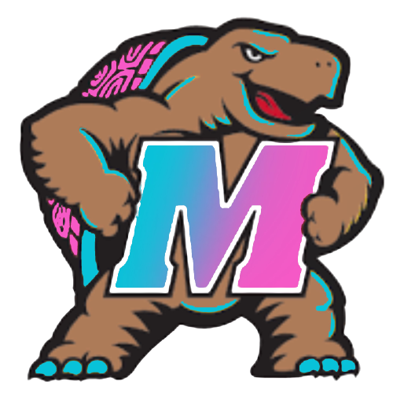

<a name="readme-top"></a>

<!-- PROJECT LOGO -->
<p align="center">
  
  
</p>
<br />
<div align="center">
  <a href="https://github.com/IreneL7/StudyTerp"></a>

<h3 align="center" font-size=36px>Study Terp</h3>

  <p align="center">
    Tinder, but for studying.
    <br />
  </p>
</div>

<!-- TABLE OF CONTENTS -->
<details>
  <summary>Table of Contents</summary>
  <ol>
    <li>
      <a href="#about-the-project">About The Project</a>
      <ul>
        <li><a href="#built-with">Built With</a></li>
      </ul>
    </li>
    <li>
      <a href="#getting-started">Getting Started</a>
      <ul>
        <li><a href="#installation">Installation</a></li>
      </ul>
    </li>
    <li><a href="#roadmap">Roadmap</a></li>
    <li><a href="#contributing">Contributing</a></li>
    <li><a href="#acknowledgments">Acknowledgments</a></li>
  </ol>
</details>

<!-- ABOUT THE PROJECT -->
## About The Project 📘

Study Terp is a study buddy matchmaker for students at the University of Maryland. Through this revolutionary social 
study platform, students are matched with study buddies based on classes, schedules, majors/minors, study habits,
and overall compatibility. Study Terp aims to foster a supportive and collaborative learning environment on demand 
for every student by connecting them with like-minded peers. Say goodbye to solo study struggles and hello to a brighter,
more interactive academic journey. Your perfect study buddy is just a click away!

<p align="right">(<a href="#readme-top">back to top</a>)</p>

### Built With ⚒️

* [![JavaScript][JS.js]][JS-url]
* [![HTML][HTML.com]][HTML-url]
* [![CSS3][CSS.com]][CSS-url]

<p align="right">(<a href="#readme-top">back to top</a>)</p>

<!-- GETTING STARTED -->
## Getting Started 🏆

To get a local copy up and running follow these simple example steps.

### Installation 💻

1. Clone the repo
   ```sh
   git clone https://github.com/IreneL7/StudyTerp.git
   ```
3. Install NPM packages
   ```sh
   npm install
   ```

<p align="right">(<a href="#readme-top">back to top</a>)</p>

<!-- ROADMAP -->
## Roadmap 🗺️

- Brainstormed idea and features of product
- Designed web app components in VS Code
- Implemented matchmaking algorithm
- Tested privacy leaks and addressed security concerns

See the [open issues](https://github.com/IreneL7/StudyTerp/issues) for a full list of proposed features (and known issues).

<p align="right">(<a href="#readme-top">back to top</a>)</p>

<!-- CONTRIBUTING -->
## Contributing 🤚

Contributions are always welcome and **greatly appreciated**. We would love to make our studying Tinder app better and more suited towards students' needs. 

If you have a suggestion that would make this better, please fork the repo and create a pull request. Or, you can contact us directly and submit ideas. You can also simply open an issue with the tag "enhancement".

1. Fork the Project
2. Create your Feature Branch (`git checkout -b feature/AmazingFeature`)
3. Commit your Changes (`git commit -m 'Add some AmazingFeature'`)
4. Push to the Branch (`git push origin feature/AmazingFeature`)
5. Open a Pull Request

<p align="right">(<a href="#readme-top">back to top</a>)</p>

<!-- ACKNOWLEDGMENTS -->
## Acknowledgments 💙

Special thanks to [Technica](https://gotechnica.org/) and all the sponsors, organizers, and other hackers for making this hackathon an amazing experience!

<p align="right">(<a href="#readme-top">back to top</a>)</p>

<!-- MARKDOWN LINKS & IMAGES -->
[JS.js]: https://img.shields.io/badge/javascript-%23323330.svg?style=for-the-badge&logo=javascript&logoColor=%23F7DF1E
[JS-url]: https://JavaScript.com/
[HTML.com]: https://img.shields.io/badge/html5-%23E34F26.svg?style=for-the-badge&logo=html5&logoColor=white
[HTML-url]: https://html.com/
[CSS.com]: https://img.shields.io/badge/css3-%231572B6.svg?style=for-the-badge&logo=css3&logoColor=white 
[CSS-url]: https://www.w3.org/Style/CSS/Overview.en.html#
